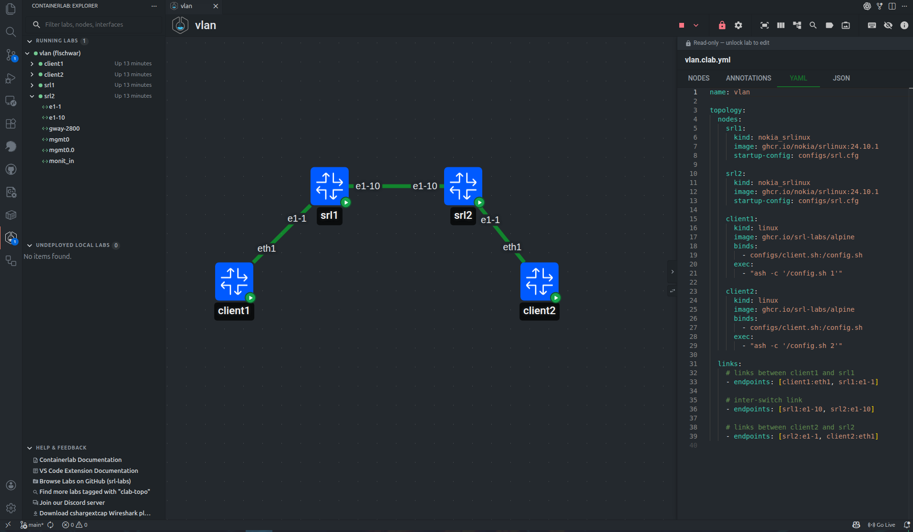
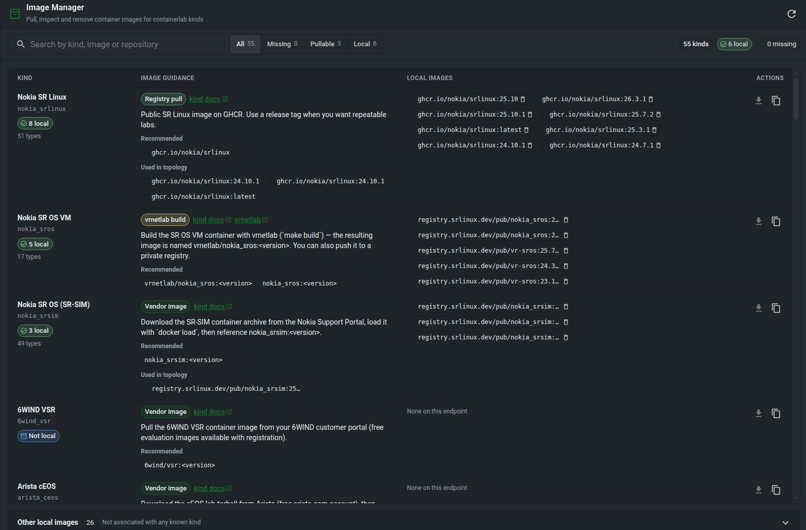

# Run your labs

Deploy a topology, work with its devices, and manage the images your lab needs. These actions run on the Linux host connected to your app.

## Operating labs

From the GUI you can deploy, redeploy, destroy, start, stop, restart, save, graph, and inspect labs where the host supports those actions.

Running nodes expose actions such as:

* open shell
* open SSH session
* show logs
* copy node details
* start, stop, or restart the node
* capture packets from an interface
* manage link impairments

In VS Code, shell and SSH actions open VS Code terminals. In Desktop and Web, terminal sessions are proxied through `clab-api-server` and shown in standalone terminal windows.

## Image manager

The GUI can manage local container images when the host exposes image operations.

Use the image manager to see images referenced by labs and custom node templates, pull missing images, and remove images that are no longer needed.
