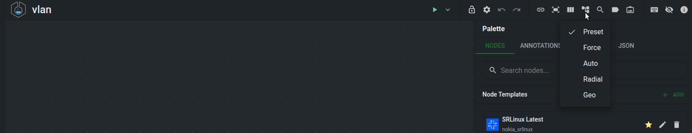
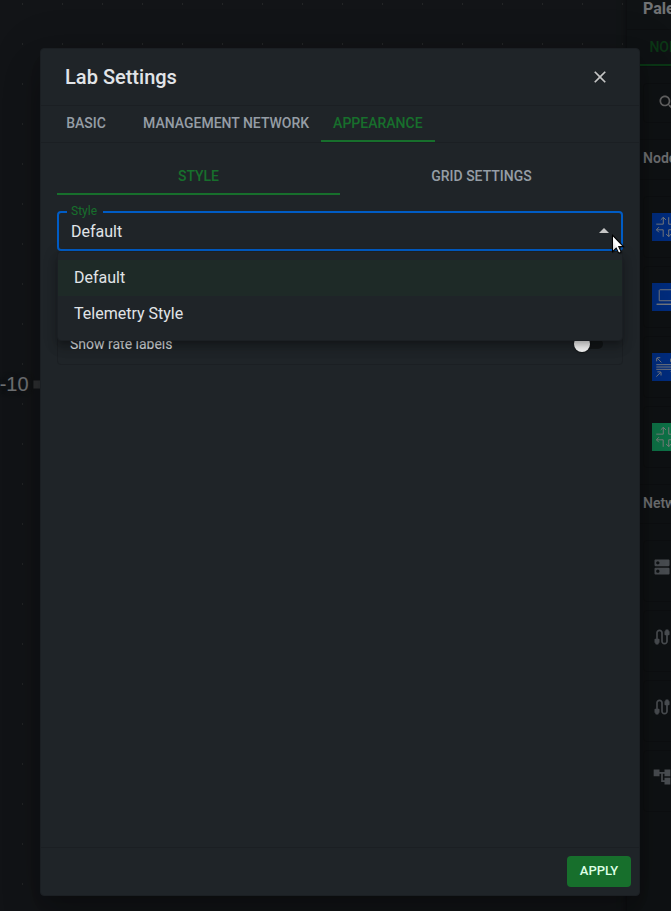
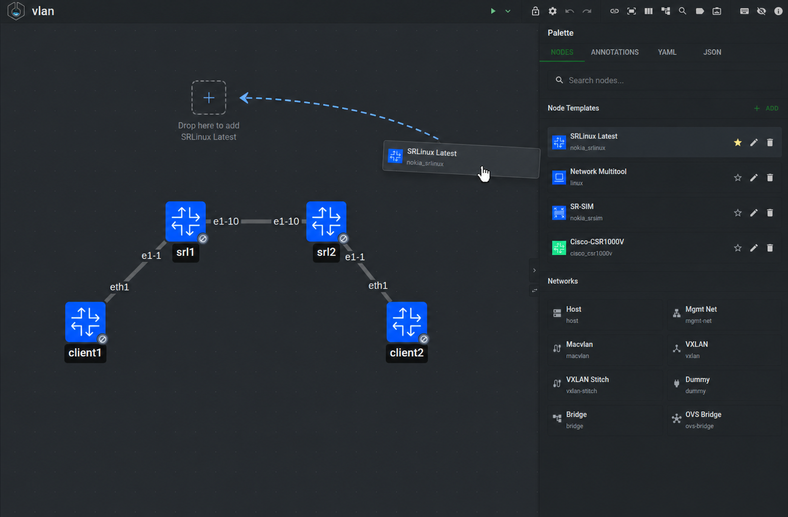
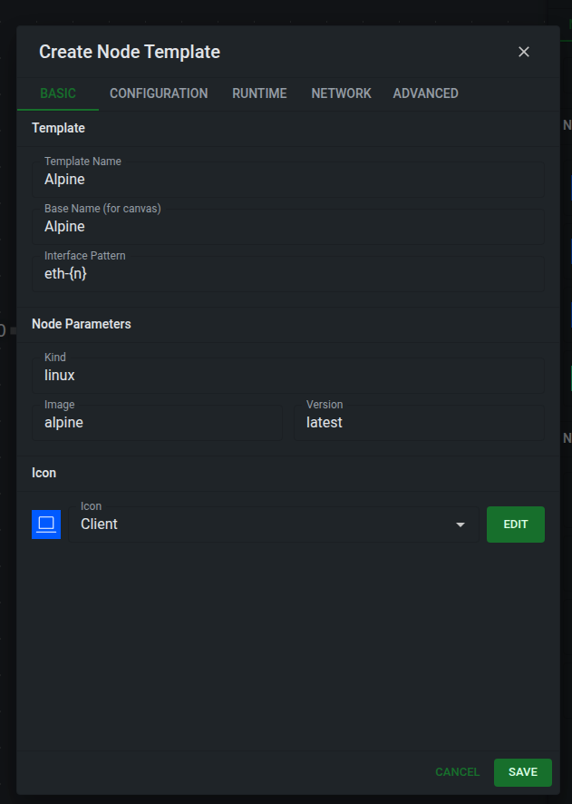

# Layouts and node templates

Arrange your network so it is easy to read, and reuse device configurations when you build the next lab.

## Layouts and appearance

The layout menu changes how TopoViewer places nodes on the canvas.

| Layout | Use it for |
| ------ | ---------- |
| Preset | Keep the positions already stored in the annotations file, or the positions you arranged manually. |
| Auto | Build a readable generated layout for most topologies. Tree-like parts are arranged hierarchically, while dense mesh-like parts are handled separately. |
| Force | Spread dense or irregular topologies with a force-directed layout. |
| Radial | Place hierarchical topologies around a central node. |
| Geo | Work with topology positions on a map when geographic coordinates are available. |

Generated layouts update the node positions saved in the annotations file. They arrange topology nodes and network nodes; text, shapes, groups, and traffic-rate annotations remain visual annotations that you position yourself.

The Appearance tab in the lab settings controls how the canvas is presented. The default style keeps the normal editor view. **Telemetry Style** changes the topology into a dashboard-oriented view with configurable node size, interface bubble size, and compact interface labels.

/// admonition | Telemetry Style
    type: info
Telemetry Style is only a display style. It does not deploy Grafana, Prometheus, or any telemetry collector by itself. Use it when you want the topology to look like a monitoring diagram, or when you plan to export a Grafana bundle.
///

The Appearance tab also controls:

* rate labels, which add traffic-rate annotation labels near link endpoints
* global and per-interface label shortening for long interface names
* grid style, grid color, and canvas background color

The **Link Labels** toolbar menu is separate from Telemetry Style. Use it to show all link labels, show them only when a link is selected, or hide them on the canvas.

Appearance preferences are saved with the topology annotations so the view can be shared with the lab files.

## Node templates and drag-and-drop

Node templates are reusable node presets shown in the **Node Templates** palette.

Drag a template from the palette onto the canvas to create a node at that position. You can also mark one template as the default template; quick-add actions such as adding a node from the canvas use that default when no explicit template is selected.

A node template can define common node fields such as:

* `kind`
* `type`
* `image`
* icon and icon color
* startup config, binds, environment variables, licenses, and other node options
* `baseName`, used to generate node names such as `srl1`, `srl2`, and `srl3`

Use the template editor to create or edit node templates.

/// admonition | Interface pattern
    type: info
`interfacePattern` tells the editor how to name interfaces when it creates links for a node. The pattern contains an `{n}` placeholder, and the editor replaces it with the next available interface number.

Use `{n}` for simple numbering. For example, `e1-{n}` creates `e1-1`, `e1-2`, `e1-3`, and `eth{n}` creates `eth1`, `eth2`, `eth3`.

Use `{n:start}` to choose the first number. For example, `eth{n:0}` starts with `eth0`, and `Gi0/0/{n:2}` starts with `Gi0/0/2`.

Use `{n:start-end}` to limit a range, and separate multiple patterns with commas when a node has split interface blocks. The editor fills the first range, then jumps to the next pattern. For example, `1/1/c{n:1-2}/1,1/1/c{n:5-6}/1` creates `1/1/c1/1`, `1/1/c2/1`, then jumps to `1/1/c5/1` and `1/1/c6/1`.

Set this on custom node templates when the node kind uses interface names that the editor cannot infer from the kind alone.
///

Templates make the editor faster, but they do not introduce a new topology format. When you create a node from a template, the GUI writes a normal Containerlab node definition to the topology YAML.

The palette also contains networks and annotations. Drag networks onto the canvas to add management or bridge-style network objects. Drag annotations to add text, shapes, groups, and traffic-rate labels that are saved in the annotations file next to the topology.
