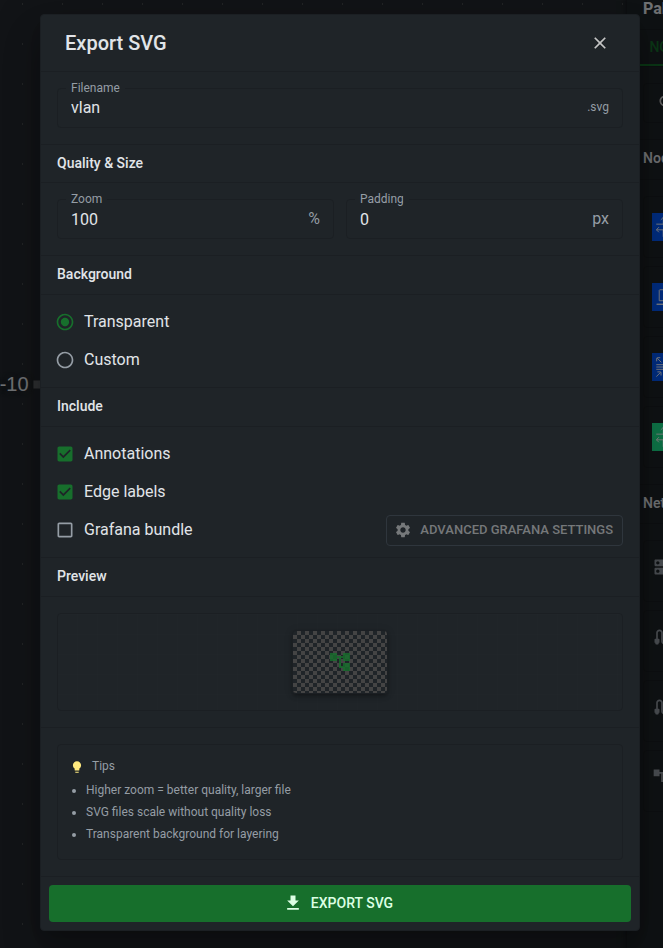
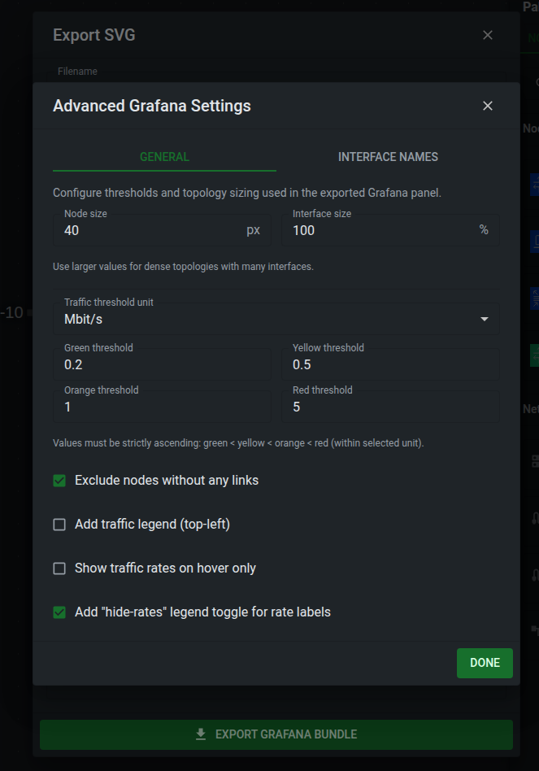
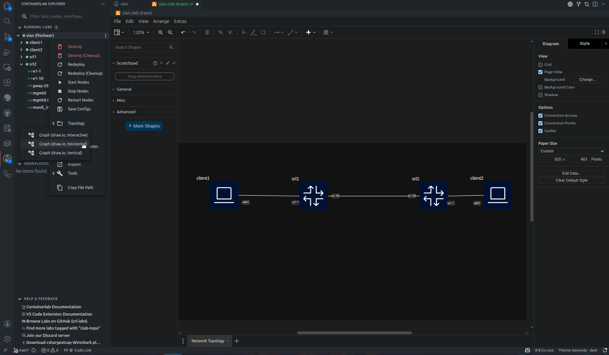

# Export and share

Work on shared labs with other users, share a snapshot of your canvas, prepare a Grafana panel, or put an interactive topology in your documentation.

## Shared labs in Desktop and Web

When your API server enables a shared workspace, **Shared labs** appears in its
File Explorer. Everyone signed in to that server can read, edit, deploy, operate,
and destroy labs in this folder. Terminals and capture sessions remain personal.

Use the folder's menu to create a topology, create a subfolder, or upload files.
Shared topologies also appear in the running and undeployed lab lists with a
**Shared** badge. You can open and edit a shared lab deployed by someone else,
and it remains visible when other users' personal labs are hidden. The owner
shown on a running lab identifies who deployed it.

Destroying a shared lab leaves its source files available for the next deployment.
Deleting a shared file or subfolder removes it for everyone. The shared root
cannot be renamed or deleted, and files cannot be moved between personal and
shared workspaces.

Topology changes from other editors refresh the canvas. If a file changes while
you have an older edit open, a stale save is rejected. The text editor keeps your
unsaved changes so you can copy them before reopening the current file.

See [API server setup](../manual/api-server.md) for enabling the folder.

## SVG and Grafana export

Use **Capture Viewport as SVG** to export the visible TopoViewer canvas.

The SVG export dialog lets you choose the filename, zoom, padding, background, annotations, and edge labels. A plain SVG export creates one `.svg` file that can be used in documentation, diagrams, or external tools.

Enable **Grafana bundle** when you want to use the topology as a Grafana Flow Panel. The export creates:

| File | Purpose |
| ---- | ------- |
| `<name>.svg` | The topology SVG with Grafana cell IDs. |
| `<name>.grafana.json` | A Grafana dashboard JSON containing the Flow Panel. |
| `<name>.flow_panel.yaml` | Flow Panel mapping and threshold configuration. |

The Grafana bundle maps link traffic, interface endpoint state, and optional traffic-rate labels to Grafana cells. Advanced settings let you tune node and interface size, traffic thresholds, interface label shortening, whether unlinked nodes are excluded, whether a traffic legend is added, and whether rate labels are only shown on hover.

/// admonition | Telemetry data
    type: info
The bundle does not deploy or configure a telemetry stack. It provides the visual panel files for a Grafana setup that already has matching telemetry data.
///

In VS Code, the extension asks where to save the exported files. In Desktop and Web, the files are downloaded by the browser or desktop webview.

## Draw.io diagrams

Graph actions can generate Draw.io diagrams for a topology or running lab.

Horizontal and vertical Draw.io layouts are available across the GUI hosts. Interactive Draw.io mode is VS Code-specific; standalone apps generate the diagram file and report the result.

Draw.io export is useful for quick documentation diagrams. Use the SVG export when you want an exact capture of the current TopoViewer canvas, including appearance settings and annotations.

## Interactive documentation

Use the [standalone Containerlab viewer](../viewer/standalone.md) to embed the actual topology alongside its YAML. The [Zensical integration](../viewer/index.md) provides a Markdown component with tabs, node inspection, and downloads.
