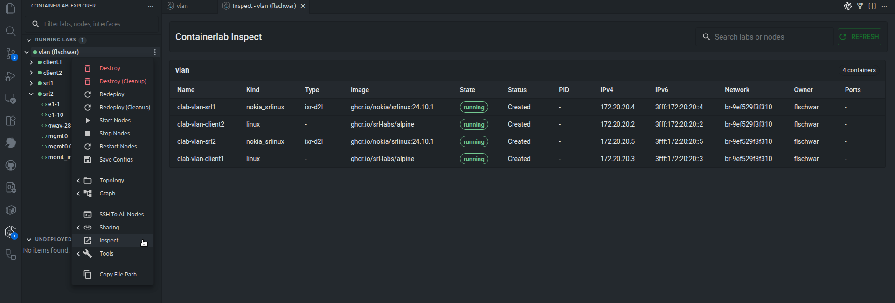
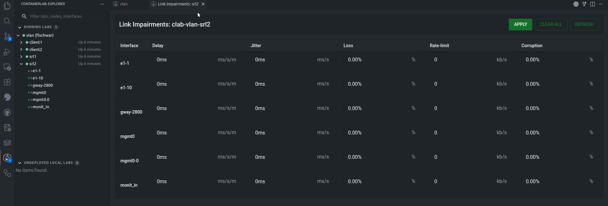
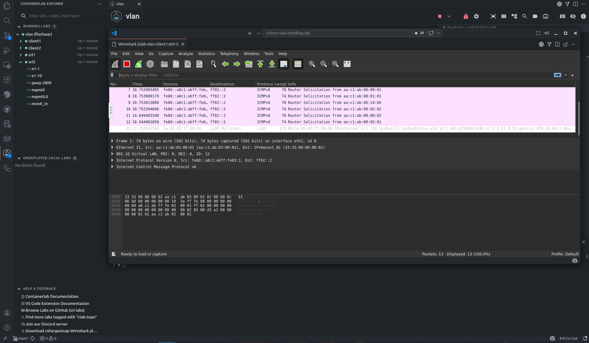

# Inspect and troubleshoot

Follow the state of a running lab, capture traffic on an interface, and test how a network behaves under difficult conditions.

## Inspect and impairments

The inspect view shows running lab details in a table similar to `containerlab inspect`.

The GUI can also manage link impairments where supported by the host platform. Link impairments include delay, jitter, packet loss, rate limiting, and corruption.

/// admonition | Platform support
    type: tip
Link impairments require Linux networking support on the Containerlab host.
///

## Packet capture

Packet capture is available from interface actions when the host supports capture operations. The GUI uses Edgeshark/Packetflix capture URIs and Wireshark VNC sessions.

The launch path depends on the host:

| Host | Capture behavior |
| ---- | ---------------- |
| VS Code | The extension starts the capture flow from the VS Code host and opens Wireshark VNC in a VS Code webview. |
| Desktop and Web | The app calls API server capture endpoints and opens Wireshark VNC in a desktop or browser window. |

For packet capture to work, the Containerlab host must be able to run the required capture containers and expose the capture stream to the GUI host.
