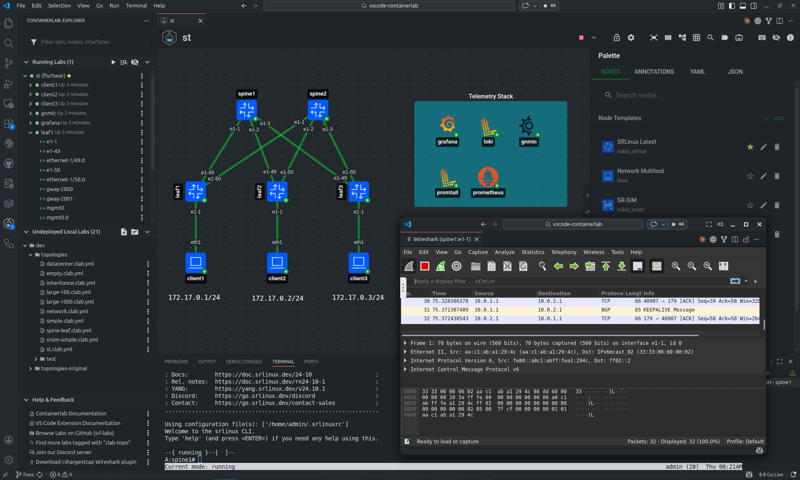
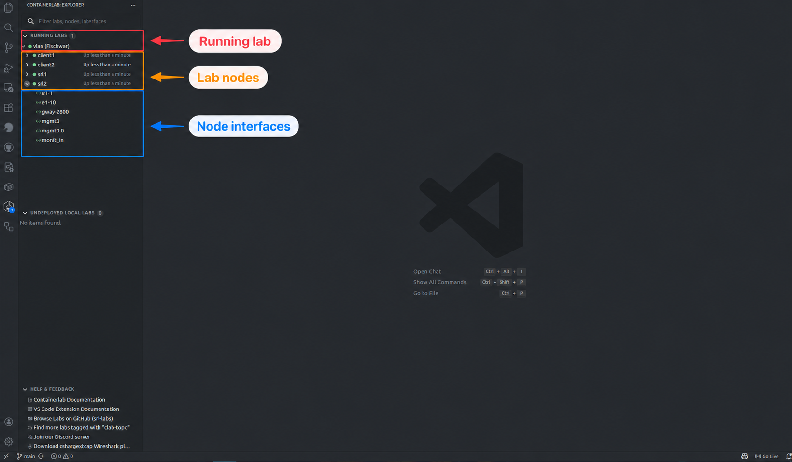

---
tags:
  - GUI
---

# The workspace

Containerlab GUI is the graphical way to create, edit, deploy, and operate Containerlab labs. The same topology UI is used by the VS Code extension, the Desktop app, and the Web app; what changes is the host that performs the privileged work.

| GUI | Use it when | Runtime access |
| --- | ----------- | -------------- |
| [VS Code Extension](vsc-extension.md) | You work with topology files in VS Code, locally or through Remote SSH. | VS Code runs Containerlab commands on the VS Code host. |
| [Desktop](desktop.md) | You want a standalone application window on Linux, macOS, or Windows. | The app connects to a reachable [`clab-api-server`](../api-server.md). |
| [Web](web.md) | You want a browser UI for a shared lab host, VM, or server. | The web app connects to a reachable [`clab-api-server`](../api-server.md). |
| [Browser sandbox](https://srl-labs.github.io/containerlab-app/) | You want to try the editor without installing anything. | Browser storage only; no real lab deployment. |

/// admonition | Support
If you have any questions about the apps, please join us in the [Containerlab Discord](https://discord.gg/vAyddtaEV9).
///

## How it works

The GUI is built around a shared topology editor called TopoViewer.

In VS Code, TopoViewer runs in a VS Code webview. The extension reads and writes files through VS Code APIs and runs Containerlab commands in the same environment as the VS Code window. If you use Remote SSH, that environment is the remote Linux host.

In the Desktop and Web apps, TopoViewer runs in the standalone app. The standalone app talks to `clab-api-server`, and the API server performs lab lifecycle, file, terminal, capture, image, and inspection operations on the Linux host where Containerlab and the container runtime live.

This split is important:

* the topology editor is shared across all GUIs
* VS Code does not need `clab-api-server`
* Desktop and Web do need `clab-api-server`
* Containerlab labs remain normal `*.clab.yml` files that can still be reviewed, version controlled, and used from the CLI

The GUI may also create an annotations file next to the topology file. The topology YAML keeps the lab definition. The annotations file stores visual data such as node positions, free text, shapes, groups, and display preferences.

Custom node templates are host state, not topology state. They are reusable presets used by the editor to create normal Containerlab nodes. The storage location depends on the host: VS Code stores them in VS Code settings, Desktop and Web load them from the selected API server endpoint and Linux user, and the browser sandbox stores them in browser storage.

## Shared workflow

The GUI follows the same lifecycle as the CLI:

1. Create or open a topology file.
2. Edit nodes, links, labels, groups, and topology metadata.
3. Deploy the lab.
4. Inspect and operate running nodes.
5. Destroy, redeploy, or save the lab when needed.

Most workflows start in the Explorer or directly in TopoViewer.

## Explorer

The Explorer shows running labs, known topology files, endpoints, and common actions.

The Explorer can:

* search and filter labs, nodes, and interfaces
* show running, stopped, partial, and undeployed labs
* expand running labs down to nodes and interfaces
* expose lab, node, and interface actions
* show live interface statistics
* group labs by API endpoint in standalone apps
* hide labs owned by other users when the API server provides ownership metadata

VS Code discovers topology files from the open workspace and running labs from the Containerlab host. Desktop and Web discover files and running labs through the API server endpoints you sign in to. When multiple endpoints are connected, the Explorer groups labs and files by endpoint so one GUI can operate several lab hosts without mixing their state.

## Explore the GUI

| What you want to do | Guide |
| --- | --- |
| Add nodes, connect interfaces, and work in YAML | [Design a topology](../../guides/topologies.md) |
| Arrange your canvas and reuse node configurations | [Layouts and templates](../../guides/layouts.md) |
| Deploy a lab, open a terminal, or manage images | [Run your labs](../../guides/labs.md) |
| Inspect devices, capture packets, or add link impairments | [Inspect and troubleshoot](../../guides/troubleshooting.md) |
| Export an SVG or Grafana bundle | [Export and share](../../guides/sharing.md) |
| Work faster on the canvas | [Keyboard shortcuts](../../guides/shortcuts.md) |

## Host support

| Capability | VS Code Extension | Desktop and Web |
| ---------- | ----------------- | --------------- |
| Lab runtime owner | VS Code host | `clab-api-server` host |
| Authentication | Local VS Code user/session | Linux/PAM user accepted by API server |
| Topology file access | VS Code workspace and host filesystem | API server file APIs |
| Running lab updates | Containerlab events or polling | API server event streams |
| Node terminals | VS Code terminals | Browser/desktop terminal windows |
| Packet capture | Extension commands and VS Code webviews | API server capture endpoints |
| Custom node templates | VS Code settings | Per Linux user on the selected API server endpoint |
| Layouts and appearance | Shared TopoViewer behavior | Shared TopoViewer behavior |
| SVG export | Save through VS Code | Download through browser or desktop webview |
| Grafana bundle export | Save `.svg`, `.grafana.json`, and `.flow_panel.yaml` through VS Code | Download `.svg`, `.grafana.json`, and `.flow_panel.yaml` |
| Best remote workflow | VS Code Remote SSH | Reachable API server endpoint |

## Try the sandbox

The [browser sandbox](https://srl-labs.github.io/containerlab-app/) is useful for trying the editor, drafting `*.clab.yml` files, and visualizing topologies without installing anything.

The sandbox stores files in browser storage and does not connect to a real Containerlab host. To deploy, destroy, inspect, capture packets, or open terminals, use the VS Code extension, Desktop app, or Web app with a real Containerlab host.
